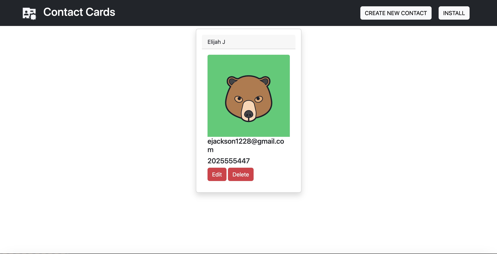

 [] 
# <h1 align="center">Contact Cards</h1>

<a href="">

 
## Description
a PWA for creating contact cards wherever and whenever! Download the app and to get offline functionality! 
  
## Table of Contents
  - [Description](#description)
  - [Installation](#installation)
  - [Usage](#usage)
  - [License](#license)
  - [Contributors](#contributors)
  - [Questions](#questions)

## Installation
Clone this repository to your local machine, install the appropriate packages, and create a build using ``npm run build``. Refer to package.json for more scripting commands.

## Usage
Use this app as a simple alternative to saving contacts.

## License
[]This application is covered under the MIT license. (https://opensource.org/licenses/MIT)

## Contributors
- Express.js (https://expressjs.com/)
- webpack (https://webpack.js.org/)
- bootstrap (https://getbootstrap.com/)
- babel (https://babeljs.io/)
- popperJS (https://popper.js.org/)

## Questions? Contact me:
GitHub: https://github.com/ejackson1228/  
Email: ejackson1228@gmail.com